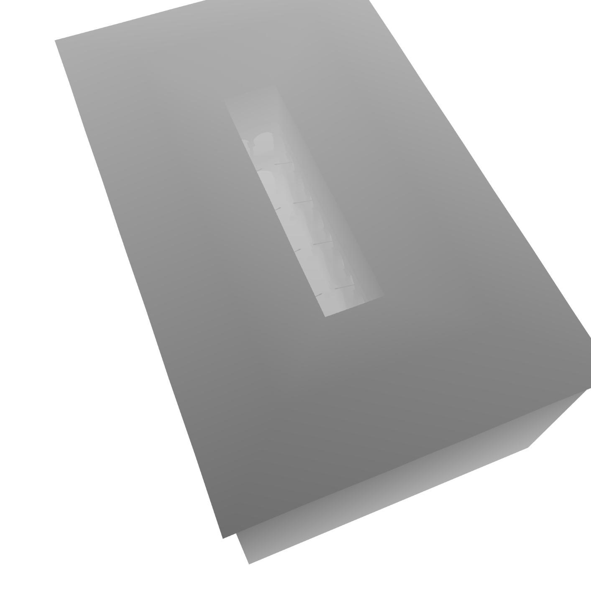
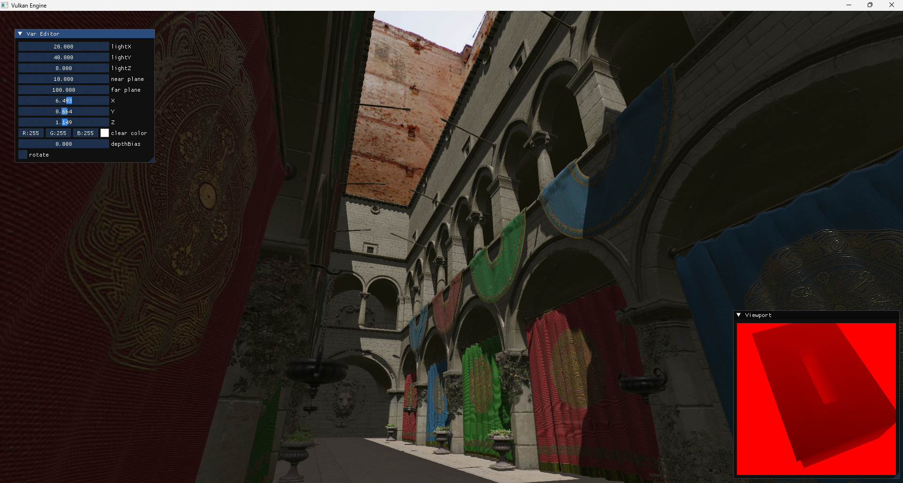
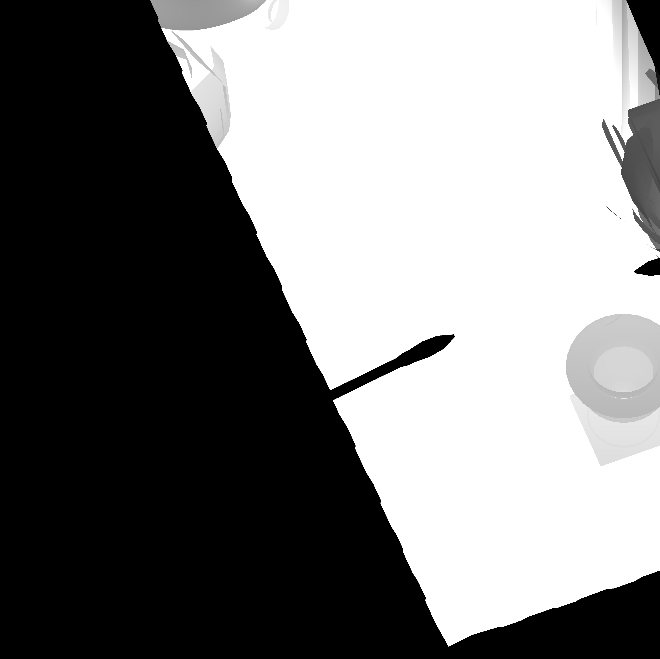
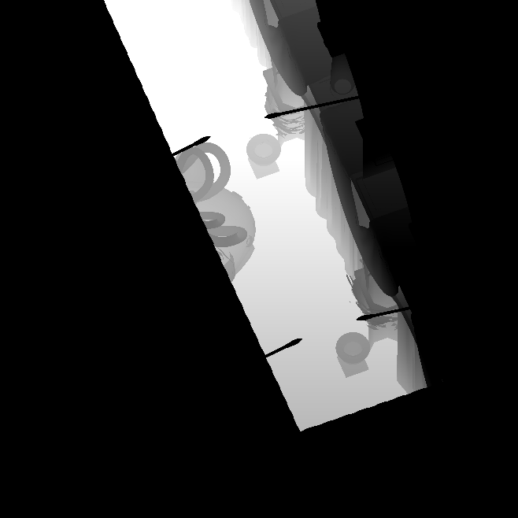
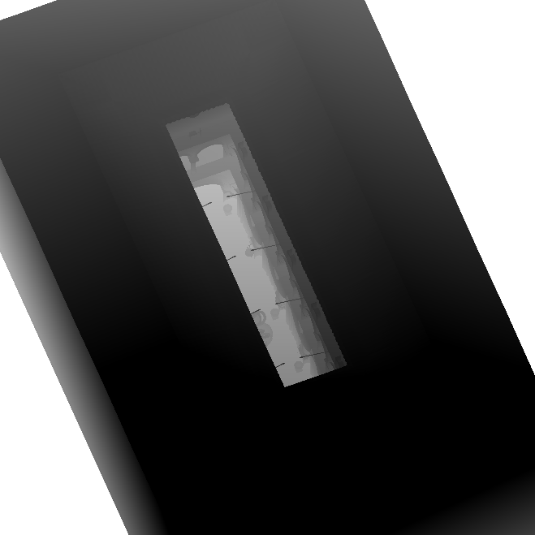
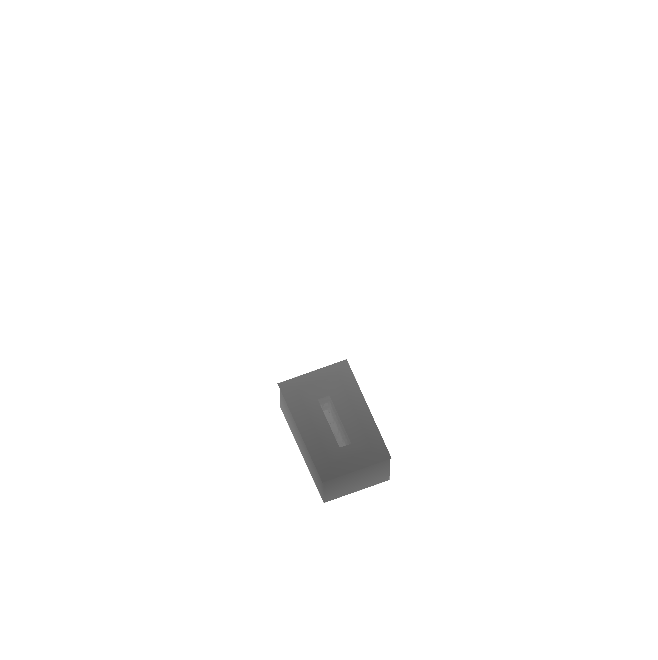

# ORCHID

## My goals for this project
* Create an engine I can use as a base for a third person shooter game demo
* Have a space I can use to try to implement various graphics programming concepts
* Create a portfolio piece I can use to both demonstrate my game engine and graphics programming knowledge

## Current Features
### PBR Textures
|                                                     Base Color                                                  |                                                     Normal                                                                    |
| :-------------------------------------------------------------------------------------------------------------: | :---------------------------------------------------------------------------------------------------------------------------: |
|                                                                             |                                                                                              |
|                                                     Metallic Roughness                                          |                                                     Final Output                                                              |
|                                                                     |                                                                                            |

I implemented the Cook-Torrence BRDF with reference from: https://learnopengl.com/PBR/Theory. When loading a gltf file, my loader implemntation searches for each texture (albedo, normal, metallic/roughness, ao, and emission), and if it cannot find any, a default texture is used. 

### Image-Based Lighting
|                                      Warm Skybox                         |                     Cool Skybox                                          |
| :----------------------------------------------------------------------: | :----------------------------------------------------------------------: |
|                                          |                                            |

Ambient lighting is entirely controlled by the chosen skybox images. I create 2 cubemaps based on the skybox: an Irradiance cubemap, which provides the total diffuse lighting from the skybox, and a Prefiltered Environment cubemap, which filters the skybox based on roughness levels to aid in computation of specular reflections. I also generate a BRDF Lookup Table as a texture which contains a scale in the red channel and a bias in the green channel that get multiplied by the Fresnel value and the prefiltered environment map color to provide the specular component. Each cubemap/image is generated in its own offscreen renderpass.

### Shadow Mapping
|                                      Shadow Map                          |          Fragment Shader Output                                          |
| :----------------------------------------------------------------------: | :----------------------------------------------------------------------: |
|                                 |                                 |

Basic area light shadowmapping by rendering the scene from the light's perspective. This texture is then passed into the fragment shader where a shadow coordinate is calculated by multiplying the world coordinates by the light's View * Projection matrix. Based on these coordinates and the shadow map, it is determined whether or not the fragment is visible or not from the light's point of view, and that decides if the fragment is lit or shaded. Currently working on cascaded shadow mapping, where I aim to change the perspective area light implementation into an orthographic directional light.

### Cascaded Shadow Mapping - 06/17/2024

|                              Shadow Map Slice 1             |          Shadow Map Slice 2                                 |
| :---------------------------------------------------------: | :---------------------------------------------------------: |
|                                 |                                 |
|                                Shadow Map Slice 3           |                  Shadow Map Slice 4                         |
|                                 |                                 |

|                                 Final Output                             |
| :----------------------------------------------------------------------: |
|                                         |

Basic area light shadowmapping by rendering the scene from the light's perspective. This texture is then passed into the fragment shader where a shadow coordinate is calculated by multiplying the world coordinates by the light's View * Projection matrix. Based on these coordinates and the shadow map, it is determined whether or not the fragment is visible or not from the light's point of view, and that decides if the fragment is lit or shaded. Currently working on cascaded shadow mapping, where I aim to change the perspective area light implementation into an orthographic directional light.

### Animations

https://github.com/AKris0090/Orchid/assets/58652090/a1662d30-31e1-4b9d-9ecd-0a9f098e5afa

https://github.com/AKris0090/Orchid/assets/58652090/cb83ed30-a5de-4a8e-af59-68d82ffc80a4

GLTF files have the ability to store bone data and skinning information, and the gltf loader library I use (tinygltf) has a way to access these. I load and pass the bone weights and skinning matrices to the vertex shader to update the vertex position every frame, animating the objects. 

### Nvidia PhysX Implementation
I have set up a physics simulation that represents the actors in the scene, and by mapping the transform of the physics objects to the objects in my scene, I can represent physics interactions between them. I have also made use of the built-in character controller class, and plan to implement a third person camera.

## Current Venture
Third person camera using PhysX raycasting
