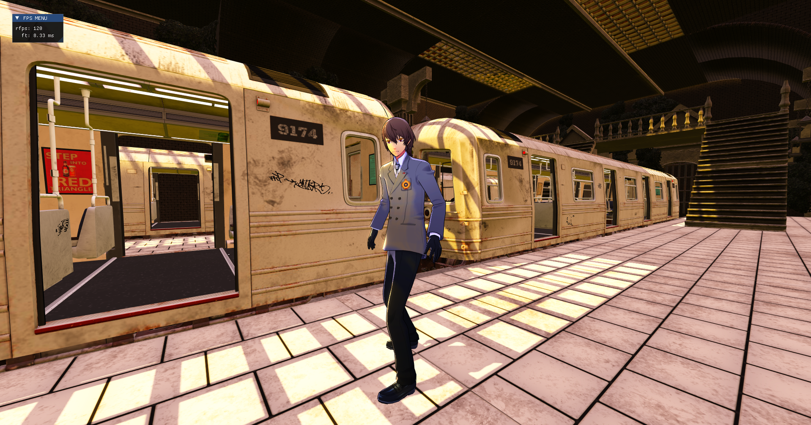
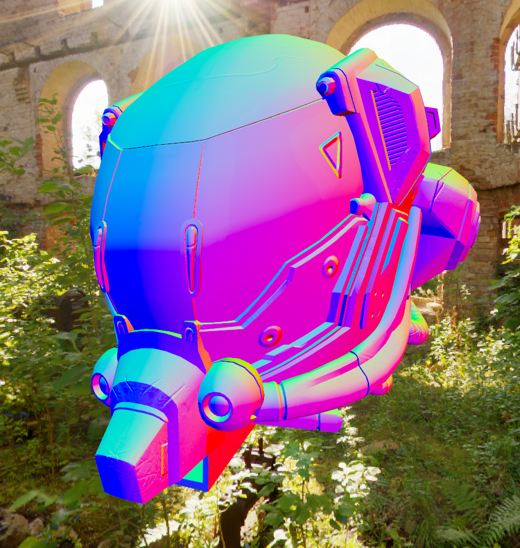
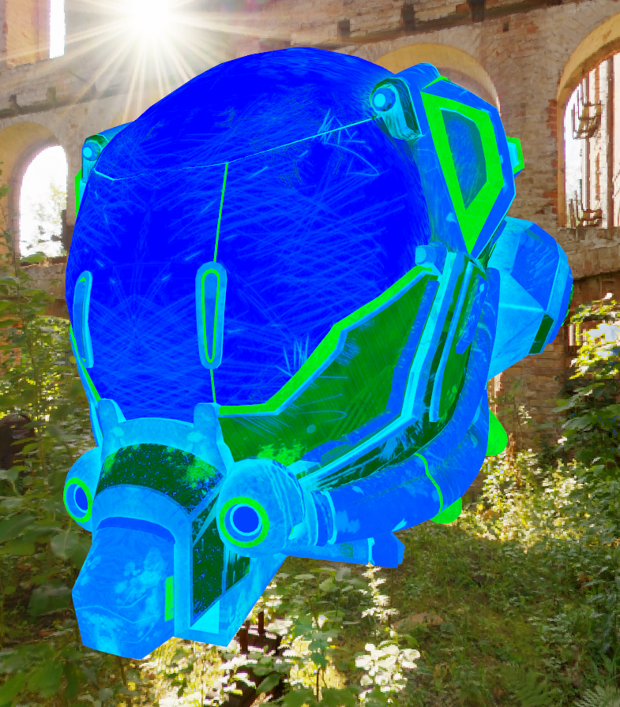
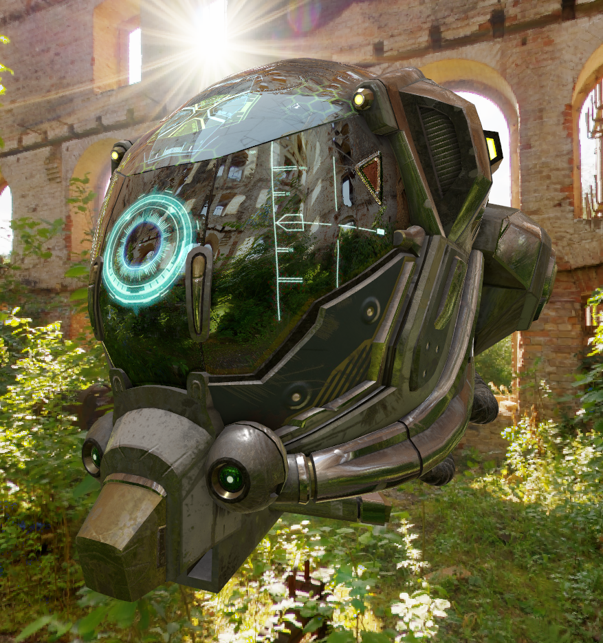
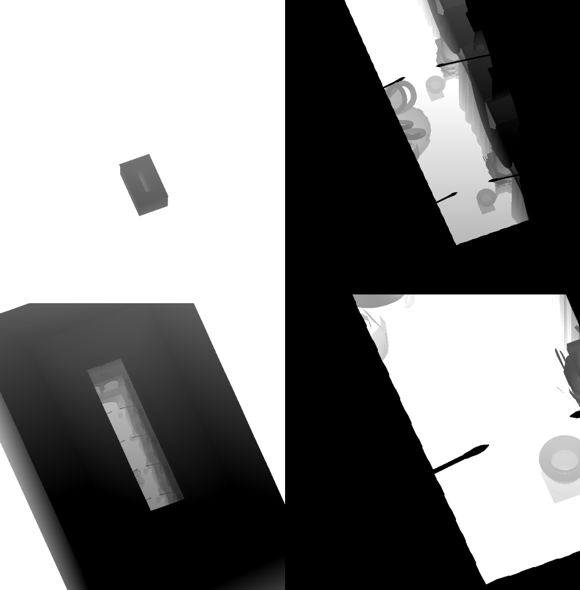
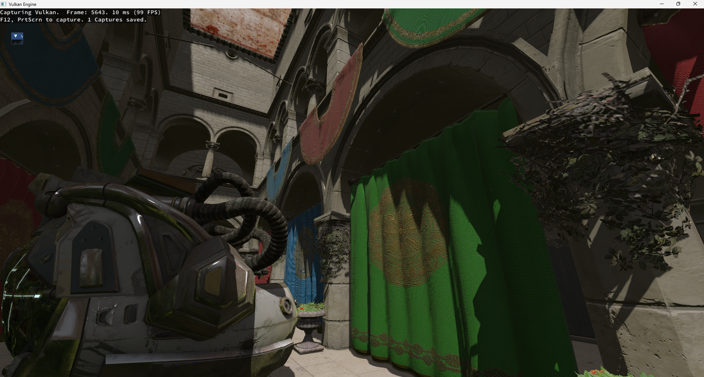
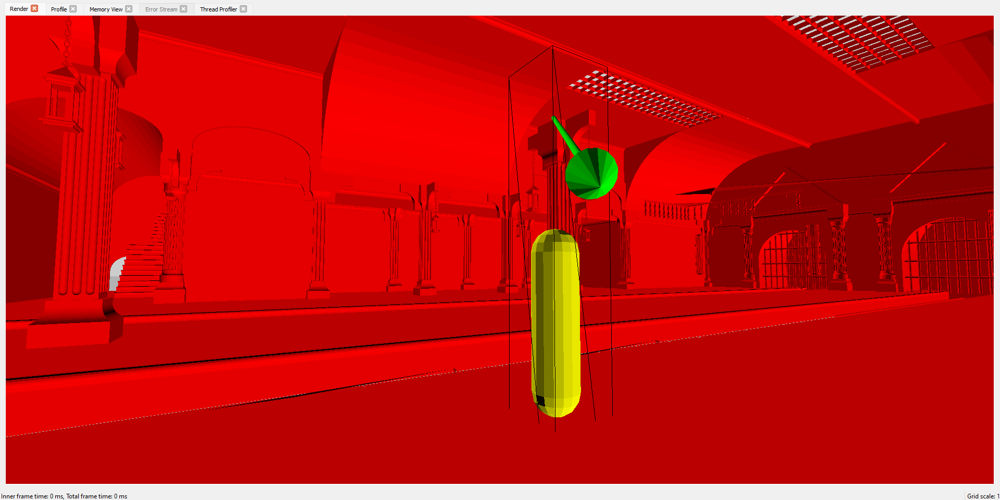

# 🌸 ORCHID
  

Orchid is a non-photorealistic forward-rendered game engine made in C++ using Vulkan and PhysX. 

## 🔥 Feature Highlights:
- [PBR Textures](#PBR-Textures)
- [Image-Based Lighting](#Image-Based-Lighting)
- [Cascaded Shadow Mapping](#Shadow-Mapping--Cascaded-Shadow-Mapping)
- [Compute Skinning / Animation](#Animations--Compute-Skinning)
- [Frustum Culling](#Frustum-Culling)
- Physically Based Bloom
- Inverse Hull Outlines
- [Nvidia PhysX](#Nvidia-PhysX-Implementation)

## 🎯 My goals for this project
* Create an engine I can use as a base for a third person rpg game demo
* Have a space I can use to try to implement various graphics programming concepts
* Create a portfolio piece I can use to demonstrate both my game engine and graphics programming knowledge

### PBR Textures
|                                                     Base Color                                                  |                                                     Normal                                                                    |
| :-------------------------------------------------------------------------------------------------------------: | :---------------------------------------------------------------------------------------------------------------------------: |
|                                                                             |                                                                                              |
|                                                     Metallic Roughness                                          |                                                     Final Output                                                              |
|                                                                     |                                                                                            |

I implemented the Cook-Torrence BRDF with reference from: https://learnopengl.com/PBR/Theory. My loader implemntation searches for essential textures: albedo, normal, metallic/roughness, ambient occlusion, and emission. If one is not found, a default texture is used. 

### Image-Based Lighting
|                                      Warm Skybox                         |                     Cool Skybox                                          |
| :----------------------------------------------------------------------: | :----------------------------------------------------------------------: |
|                                          |                                            |

The ambient lighting is driven by the chosen skybox images. Two cubemaps are generated:

1. Irradiance Cubemap for diffuse lighting.
2. Prefiltered Environment Cubemap for specular reflections, filtered by roughness.

Each cubemap is generated with offscreen render passes.

### Shadow Mapping / Cascaded Shadow Mapping

|                              Shadow Map Slices              |          Final Output                                 |
| :---------------------------------------------------------: | :---------------------------------------------------: |
|                          |                      |

Cascaded Shadow Mapping (CSM) splits the camera’s view frustum into smaller sections, allowing detailed shadows close to the camera while reducing detail farther away. This technique solves shadow quality issues in scenes with distant light sources.

### Animations / Compute Skinning

https://github.com/AKris0090/Orchid/assets/58652090/a1662d30-31e1-4b9d-9ecd-0a9f098e5afa

https://github.com/user-attachments/assets/1af90fad-33f5-442f-94e3-69beb2525d03

GLTF files can store bone data and skinning matrices, and using tinygltf, I can implement animations. To speed up the animation process, I implemented a compute shader to handle the matrix-vertex multiplication and normalize vertex data.

### Frustum Culling

```cpp
bool frustumCheck(vec3 center, float radius) {
	for (int i = 0; i < 6; i++) {
		if (dot(vec4(center, 1.0f), ubo.frustumPlanes[i]) + radius < 0.0) { // check center+radius against each plane
			return false;
		}
	}
	return true;
}

void main() {
   	uint idx = gl_GlobalInvocationID.x + gl_GlobalInvocationID.y * gl_NumWorkGroups.x * gl_WorkGroupSize.x;
	if (idx >= pcs.numDraws) {
        	return;
    	}

	mat4 modelMatrix = modelMatrices[idx];
	vec3 center = (modelMatrix * vec4(boxes[idx].xyz, 1.0)).xyz; // transform bounding sphere into world space
	float radius = boxes[idx].w * length(vec3(modelMatrix[0][0], modelMatrix[1][0], modelMatrix[2][0])); // scale bounding sphere radius into world space

   	if (frustumCheck(center, radius)) {
		indirectDrawsOut[idx].instanceCount = 1; // if visible, set the draw instance count to 1
	} else {
		indirectDrawsOut[idx].instanceCount = 0; // if not visible, set the draw instance count to 1
	}
}
```

For each object in the scene, a bounding sphere is generated and packed into a buffer. This buffer is passed into a compute shader to determine which objects are visible based on the camera's frustum planes.

### Nvidia PhysX Implementation
|                              PhysX Simulation               |          Vulkan Output                                |
| :---------------------------------------------------------: | :---------------------------------------------------: |
|                           |                     |

A physX simulation runs in tandem with the graphical output. This includes the built-in character controller class for player moevment and raycasts for a clip-proof third person camera.
